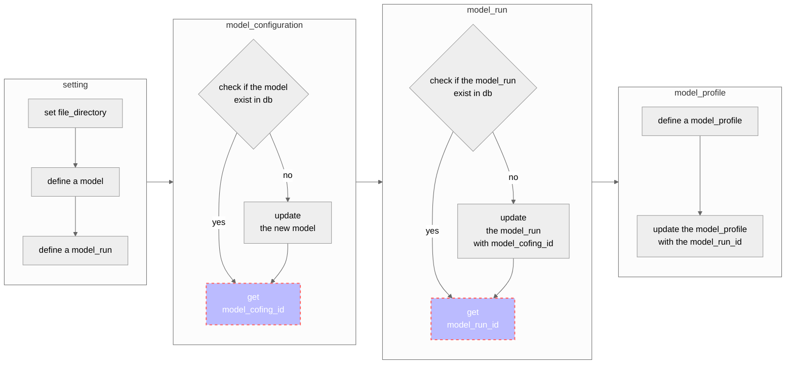

This document contains UML of Python code for daily updating lfric reports to grafana database. 

# orm_update.py UML

# file relations

**psql.py**: Create databse connection and session  
**orm_schema.py**: Define database tables and columns to be able interact with database  
**orm_upload.py**:   

# References
- [sqlalchemy official](https://docs.sqlalchemy.org/en/14/index.html)