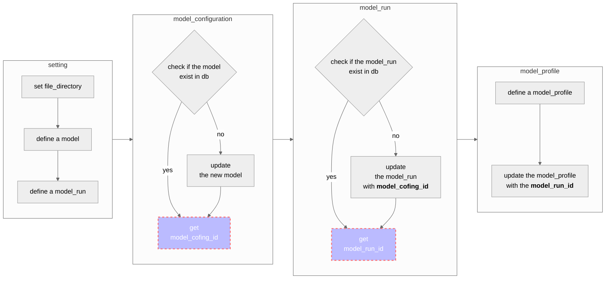

This document contains UML of Python code for daily updating lfric reports to grafana database.   

# orm_update.py  

# file relations  

**setting.py**: Database connection configuration.  
**psql.py**: Create database connection and session.  
**orm_schema.py**: Declare a mapping to interact with the database tables, columns and constraints and so on.  
**orm_upload.py**: Define a model and test results from report(s). Then update the data to the databae.  

# References  
- [sqlalchemy official](https://docs.sqlalchemy.org/en/14/index.html)  
